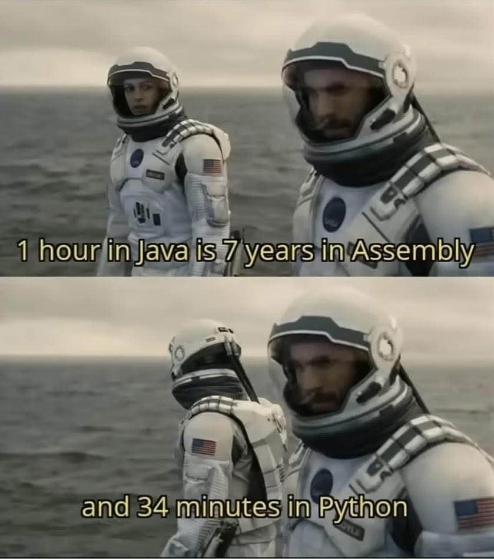

# Features (Step by Step)
1. The user is greeted with a welcome message.  
2. All the food categories (breakfast, lunch, dinner, snacks, dinners) are shown to the user.  
3. The user can select any category or exit the program.  
4. All the foods available under the selected category are displayed to the user.  
5. The user selects any food item.  
6. The user inputs the quantity of the selected food item. The quantity can be more than 9.  
7. The total price is stored and displayed to the user.  
8. From step 7, the user can go back to the food categories menu or the previous menu, order again, and have the price added to the total price, which is displayed to the user. Alternatively, the user can choose to view the bill.  
9. After the final bill is displayed to the user, they can go back to the main category menu to order again or exit the program.  
10. The system handles all types of invalid inputs from the user.

# Architecture & Topics Used
## x86 architecture
1. Basic arithmetic operations.
2. Single character I/O.
3. String output.
4. Branching.
5. Loop.
6. Stack.
7. Array.
8. Macros.
9. Procedure.

# How to run this project
1. Download EMU8086 Emulator - [DOWNLOAD EMU8086 Emulator](https://github.com/Fathin-Ishrak-Romeo/Food-ordering-system-at-restaurant-using-Assembly-Language/blob/main/emu8086-windows.zip).
2. Extract the downloaded file.
3. Install (Apply EMU8086 License Key while installation).
4. Run [this code](https://github.com/Fathin-Ishrak-Romeo/Food-ordering-system-at-restaurant-using-Assembly-Language/blob/main/Food%20Ordering%20System%20at%20Restaurant%20(User%20Interface).asm) in the EMU8086 Emulator. 

# Meme

